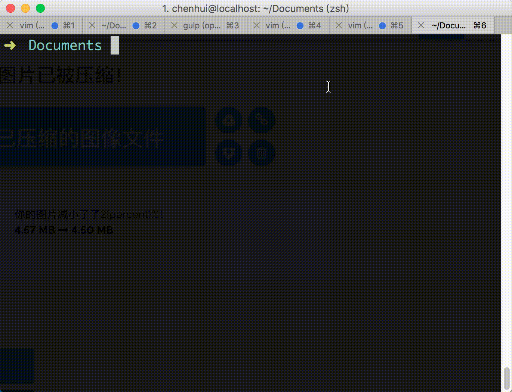

## 生成逐帧动画小工具

## 安装

```bash
npm i fbf -g
```

## 开始使用

只需一行命令，快速生成动画文件，支持效果预览。

进入img同级目录，执行
```bash
fbf start img  # 对 img 目录中的图片进行处理
```
done!



## 生成的同级文件，fbf.html

```

<!doctype html>
<html lang="en" dir="rtl">
<head>
<title>逐帧动画</title>
<meta charset="utf-8">
<link rel="icon" href="favicon.png">
<meta name="description" content="example">


</head>
<body>
<div class="fbf-animation"></div>
      <style>
      .fbf-animation{
        width: 750px;
        height: 1334px;
        margin:auto;
        background-image: url(./framebyframe/foot00.png);
        background-size: 750px 1334px;
        background-repeat: no-repeat;
        animation-name: keyframes-img;
        animation-duration: 0.36s;
        animation-delay: 0s;
        animation-iteration-count: infinite;
        animation-fill-mode: forwards;
        animation-timing-function: steps(1);
      }
      @keyframes keyframes-img {
        
        0% {
          background:url(./framebyframe/foot00.png) center center no-repeat;
          background-size:100% auto;
        }
      
        12% {
          background:url(./framebyframe/foot01.png) center center no-repeat;
          background-size:100% auto;
        }
      
        24% {
          background:url(./framebyframe/foot02.png) center center no-repeat;
          background-size:100% auto;
        }
      
        36% {
          background:url(./framebyframe/foot03.png) center center no-repeat;
          background-size:100% auto;
        }
      
        48% {
          background:url(./framebyframe/foot04.png) center center no-repeat;
          background-size:100% auto;
        }
      
        60% {
          background:url(./framebyframe/foot05.png) center center no-repeat;
          background-size:100% auto;
        }
      
        72% {
          background:url(./framebyframe/foot06.png) center center no-repeat;
          background-size:100% auto;
        }
      
        84%, 100% {
          background:url(./framebyframe/foot07.png) center center no-repeat;
          background-size:100% auto;
        }
      
      }
    </style>
</body>
</html>

```
